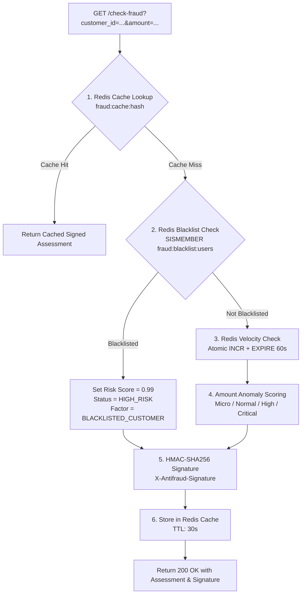

# antifraud-fastify

High-throughput, low-overhead real-time fraud detection and risk assessment microservice built with **Bun**, **Fastify v5.x**, and **Redis 8.10** (`redis:8.10-alpine3.23`).

Part of the **DevOpsDays eBPF No-Code Observability** polyglot e-commerce architecture:
`gateway-py` (FastAPI) $\to$ `payment-go` (Gin) $\to$ `antifraud-fastify` (Fastify + Redis).

---

## 🎯 Architecture & Features



* **Zero Artificial Latency**: Pure asynchronous I/O and compute, delivering sub-millisecond to low-millisecond responses.
* **Redis 8.10 In-Memory Store**:
  * **Evaluation Caching ($O(1)$)**: Identical evaluation queries return immediately with `cached: true`.
  * **$O(1)$ Blacklist Lookup**: Instant checks against Redis Sets (`SISMEMBER fraud:blacklist:users`).
  * **Atomic Velocity Counters**: `INCR` + `EXPIRE 60s` to detect rapid-fire bot attacks and card-testing probes.
* **Cryptographic Anti-Tampering**:
  * HMAC-SHA256 signing of canonical assessment data with dual emission in response body (`signature`) and header (`X-Antifraud-Signature`).
* **Kubernetes Health Probes**:
  * `/livez`: Liveness probe (`{"status": "ok"}`).
  * `/readyz`: Readiness probe testing active Redis connection via `redis.ping()`.
* **Testing with Testcontainers**:
  * Automated testing directly against live `redis:8.10-alpine3.23` containers.
* **Container Ready**: Multi-stage unprivileged Alpine Docker image (`appuser`, UID 10001).

---

## 🔌 API Endpoints

### 1. `GET /check-fraud`
Evaluates transaction risk against heuristics, velocity counters, and blacklists.

**Query Parameters:**
* `customer_id` (string, optional): Customer or user identifier.
* `amount` (number, optional): Transaction amount in currency units ($\ge 0$).

**Response (`200 OK`):**
```json
{
  "risk_score": 0.02,
  "status": "LOW_RISK",
  "factors": [
    "STANDARD_TRANSACTION_TIER"
  ],
  "velocity_count": 1,
  "cached": false,
  "signature": "sha256:7f83b1657ff1fc53b92dc18148a1d65dfc2d4b1fa3d677284addd200126d9069",
  "evaluated_at": "2026-08-17T20:00:00.000Z"
}
```

**Response Headers:**
* `X-Antifraud-Signature`: `sha256=7f83b1657ff1fc53b92dc18148a1d65dfc2d4b1fa3d677284addd200126d9069`

---

### 2. `GET /livez`
Kubernetes liveness probe.

**Response (`200 OK`):**
```json
{
  "status": "ok"
}
```

---

### 3. `GET /readyz`
Kubernetes readiness probe checking active Redis connectivity.

**Healthy (`200 OK`):**
```json
{
  "status": "ok",
  "redis": "connected"
}
```

**Degraded / Redis Down (`503 Service Unavailable`):**
```json
{
  "status": "error",
  "redis": "disconnected",
  "error": "Redis connection unavailable"
}
```

---

## ⚙️ Configuration (Environment Variables)

| Variable | Default | Description |
| :--- | :--- | :--- |
| `PORT` | `8083` | HTTP listening port |
| `HOST` | `0.0.0.0` | HTTP listening host interface |
| `ENVIRONMENT` | `development` | `development` \| `production` \| `test` |
| `LOG_LEVEL` | `info` | Pino logging level (`fatal`, `error`, `warn`, `info`, `debug`, `trace`, `silent`) |
| `REDIS_URL` | `redis://localhost:6379` | Redis connection URL |
| `REDIS_KEY_PREFIX` | `fraud:` | Redis key namespace prefix |
| `ANTIFRAUD_SECRET_KEY` | `antifraud-super-secret-key-2026` | Shared secret for HMAC-SHA256 anti-tampering signatures |
| `FRAUD_CACHE_TTL_SECONDS` | `30` | Short-lived evaluation cache TTL |
| `FRAUD_VELOCITY_WINDOW_SECONDS` | `60` | Sliding window duration for user velocity tracking |

---

## 🛠️ Development & Testing

### Install Dependencies
```bash
bun install
```

### Run Locally (with Bun)
```bash
bun run src/index.ts
```

### Run Tests (Testcontainers `redis:8.10-alpine3.23`)
```bash
bun test
```

### Run All Quality Checks
```bash
bun run format:check
bun run lint
bun run typecheck
bun test
```

---

## 🐳 Docker

### Build Image
```bash
buildah bud -t antifraud-fastify:latest .
```

### Run Container
```bash
podman run -p 8083:8083 -e REDIS_URL=redis://host.containers.internal:6379 antifraud-fastify:latest
```
